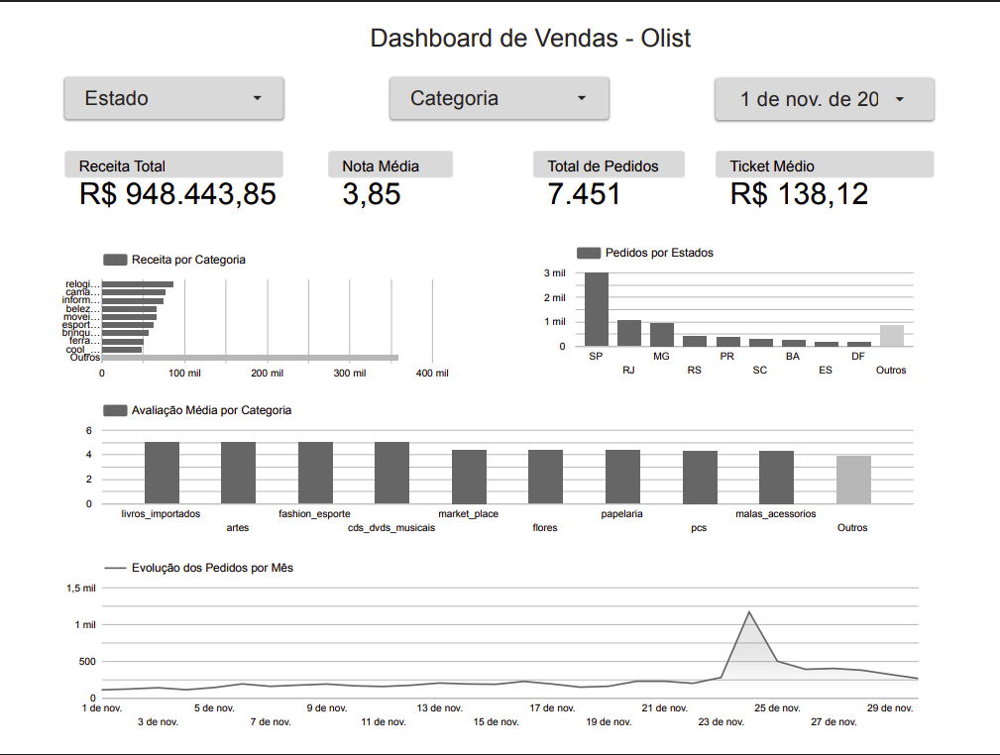

# 📊 Dashboard de Vendas - Olist

## Sobre o projeto

Dashboard desenvolvido no Looker Studio utilizando os dados tratados no projeto de Análise Exploratória de Dados (EDA) da Olist.

O objetivo é apresentar indicadores de desempenho do e-commerce de forma visual e interativa.

## Ferramentas
=======
Dashboard desenvolvido no **Looker Studio** utilizando os dados tratados no projeto de Análise Exploratória de Dados (EDA) da Olist.

O objetivo é apresentar os principais indicadores do e-commerce de forma visual e interativa, facilitando a análise do desempenho das vendas.

---

## 🛠️ Ferramentas Utilizadas

- Looker Studio
- Google Sheets
- Python (preparação dos dados)

## Indicadores

- Receita Total
- Total de Pedidos
- Ticket Médio
- Nota Média

## Visualizações

- Receita por Categoria
- Pedidos por Estado
- Evolução dos Pedidos
- Avaliação Média por Categoria

## Dashboard

## Acessar Dashboard

**Link público:** COLE O LINK AQUI

## Projeto relacionado

Os dados utilizados neste dashboard foram preparados no projeto:

➡️ https://github.com/marianyreis/eda-vendas-olist
=======
- Git e GitHub

---

## 📈 Indicadores

- 💰 Receita Total
- 📦 Total de Pedidos
- 🛒 Ticket Médio
- ⭐ Nota Média

---

## 📊 Visualizações

- Receita por Categoria
- Pedidos por Estado
- Avaliação Média por Categoria
- Evolução dos Pedidos por Mês

---

## 📸 Dashboard

---

## 🔗 Dashboard Interativo

**Acesse o dashboard:** *(cole aqui o link público do Looker Studio)*

---

## 📂 Projeto Relacionado

Os dados utilizados neste dashboard foram preparados no projeto de Análise Exploratória de Dados:

➡️ https://github.com/marianyreis/eda-vendas-olist

---

## 👩‍💻 Autora

**Mariany Reis**

Projeto desenvolvido como parte do meu portfólio para vagas na área de Análise de Dados.